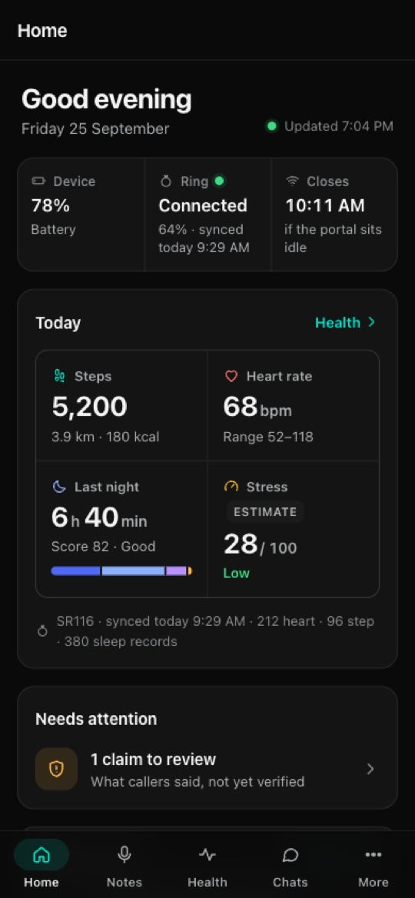
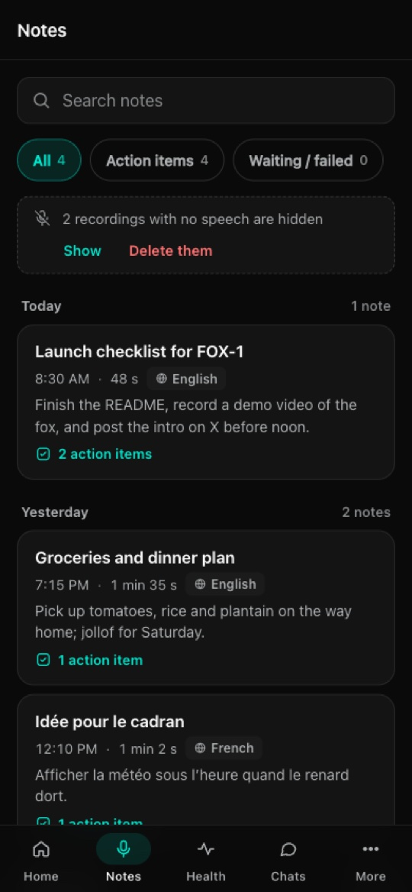
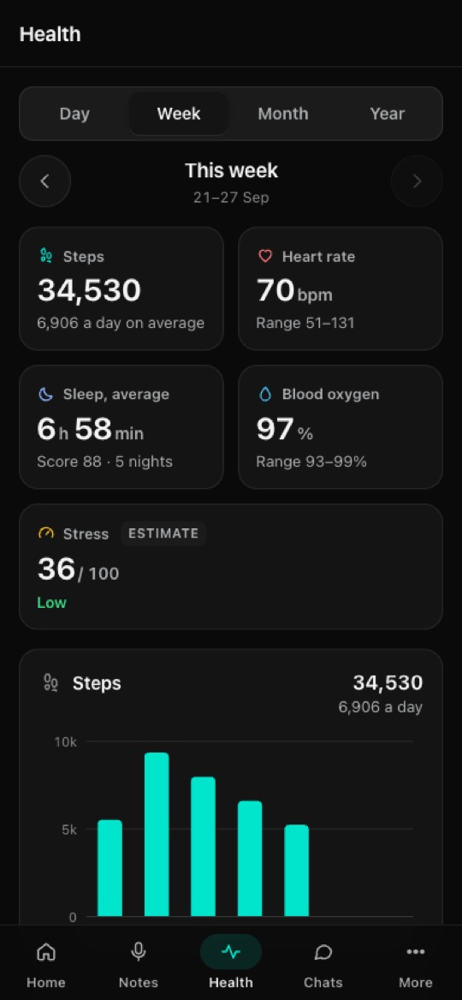
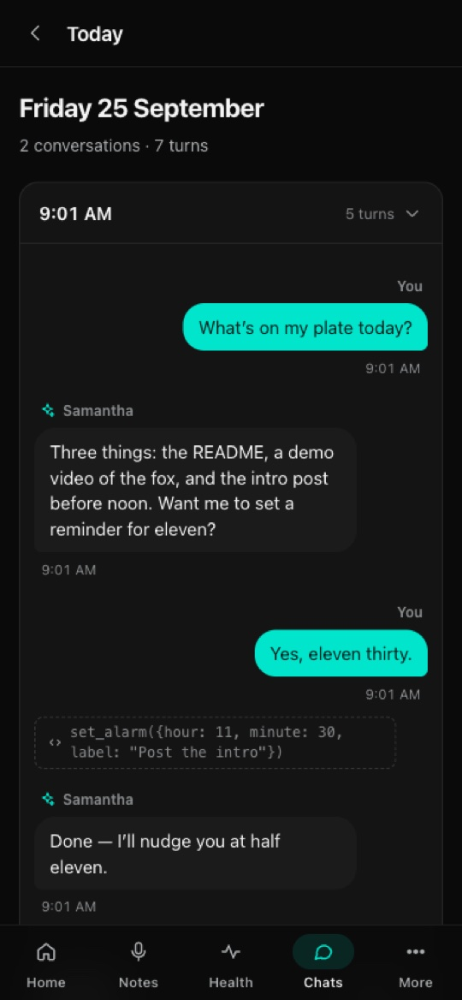
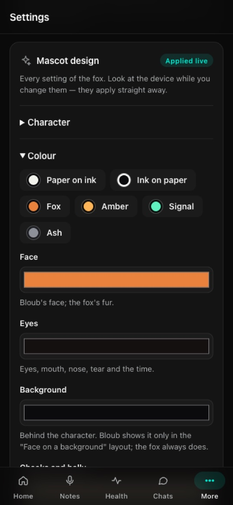
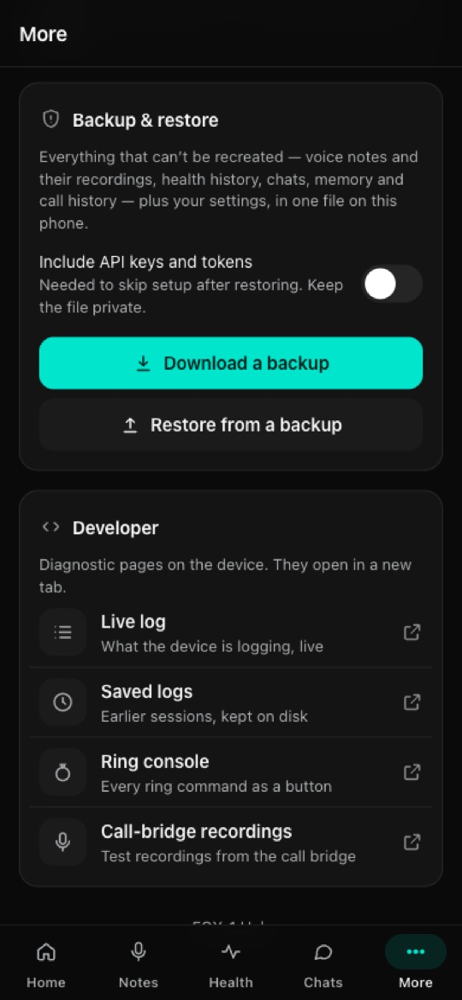
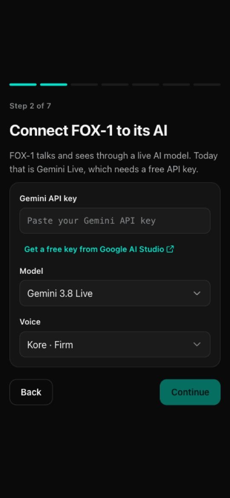
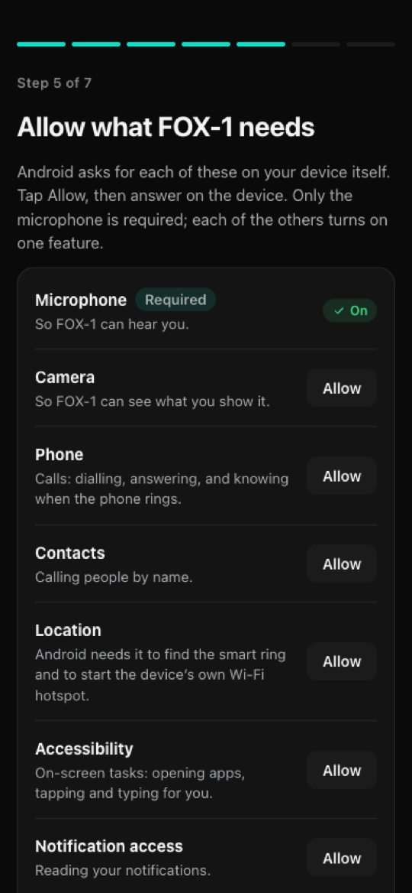
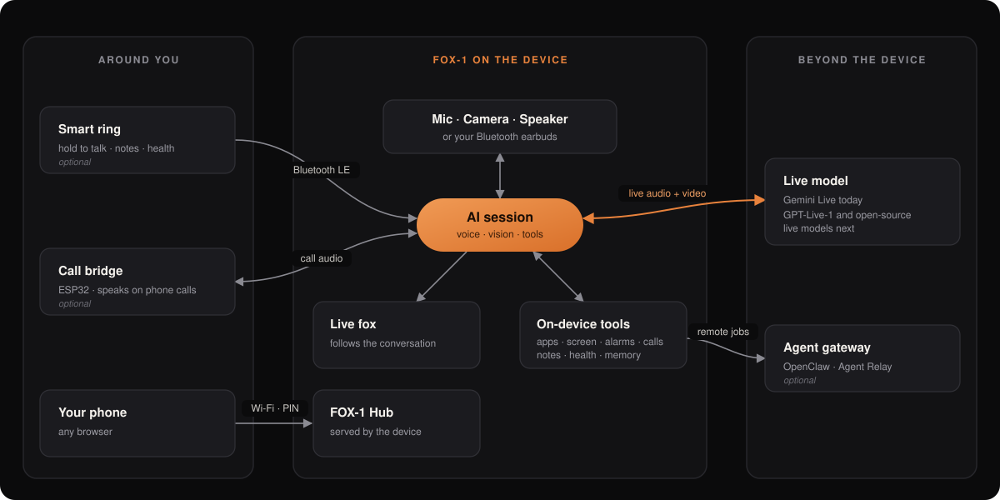

<p align="center">
  
</p>

<p align="center">
  <a href="LICENSE"></a>
  
  
  
</p>

<p align="center">
  <a href="#features">Features</a> ·
  <a href="#fox-1-hub">FOX-1 Hub</a> ·
  <a href="#hardware">Hardware</a> ·
  <a href="#install">Install</a> ·
  <a href="#set-up">Set up</a> ·
  <a href="#how-it-works">How it works</a> ·
  <a href="#roadmap">Roadmap</a>
</p>

---

**FOX-1** is an open-source AI agent you wear. A live fox on your wrist, your
keychain or your jacket talks with you in real time, looks at what you
point it at, and gets things done on the device and beyond it. It runs on
an affordable Android device, and a smart ring can serve as its button.

> [!NOTE]
> FOX-1 is **early and experimental**. It is used daily on real hardware,
> but expect rough edges. Release APKs are signed with debug keys.

## Features

| | Feature | What it does |
|:-:|---|---|
| 🎙️ | **Live conversation** | Real-time voice conversation that you can interrupt at any time. Hold the ring to talk; after that it stays hands-free. FOX-1 is built to work with more than one live model: **Gemini Live** today, with **GPT-Live-1** and open-source live models on the way. |
| 👀 | **Vision** | Looks through the device's camera when you ask about what's in front of you. |
| 📱 | **On-screen tasks** | Opens apps, reads the screen, and taps, swipes, scrolls and types for you, so it can use any app on the device. |
| ⏰ | **Device controls** | Alarms, timers, volume, brightness, contacts and calls, all by voice. |
| 🛰️ | **Remote jobs** | Hands bigger tasks to an agent gateway: [OpenClaw](https://github.com/openclaw/openclaw), or an Agent Relay (Codex or Claude Code). It keeps checking on the job and tells you when it's done. |
| 📞 | **Call agent** | Answers or places phone calls for you, talks to the caller, and reports what was said. Needs the [call bridge](https://github.com/ikequan/fox-1-call-bridge). |
| 📝 | **Voice notes and journals** | Tap the ring four times to record. The note is transcribed and summarised, with action items, people and dates, in whatever language you spoke. |
| ❤️ | **Health** | Heart rate, SpO2, steps and sleep from the ring, with day, week, month and year reports and a stress *estimate* (it is not a diagnosis). |
| 🧠 | **Memory** | Remembers what you tell it to. Anything a caller says is kept apart as a claim until you confirm it. |
| 💾 | **Backup & restore** | One file with your voice notes and recordings, health history, chats, memory, call history and settings. Restore it on the same device or a new one. |
| 🌐 | **FOX-1 Hub** | Set up, manage and personalise your device from your phone. The device serves it itself, privately. See [below](#fox-1-hub). |

## FOX-1 Hub

FOX-1 Hub is your device's companion web app. It opens on your phone and is
served by the device itself, with no account and no cloud. You use it to
set the device up, and afterwards it gives you:

- voice notes with playback;
- health reports;
- your conversations and calls;
- memory;
- every setting;
- a live editor for the fox's colours, shape and motion, whose changes reach the device while you make them.

<p align="center">
  
  
  
  
  
</p>
<p align="center"><sub>Home · Notes · Health · Chats · Mascot design. Sample data.</sub></p>

**Backup & restore**



In FOX-1 Hub, open **More → Backup & restore**.
- **Download a backup** saves everything that can't be recreated to your
  phone as one `.zip`: voice notes and their recordings, health history,
  chats, memory and call history, plus your settings. Turn on **Include API
  keys and tokens** to skip setup when you restore, and keep that file
  private.
- **Restore from a backup** puts it back, on the same device or a new one.
  You can also do this from the first page of setup. Notes, health and chats
  are added to what's there; memory, call history and settings are replaced.
  The device restarts afterwards.

<br clear="right">

**Opening it later:**
- On the device, swipe down to **Controls** and tap **Hub**. It shows a 6-digit PIN; tap it for the QR code.
- Scan the code with your phone. Your phone must be on the same Wi-Fi as the device; if the device has no Wi-Fi, it starts its own hotspot and shows a code to join that first.
- The Hub turns itself off after 30 minutes without use, and gets a new PIN every time it's turned on.
- You can also just ask FOX-1 to *"open the Hub"*.

## Hardware

| Part | Needed | Notes | Get it |
|---|:-:|---|:-:|
| **Android device** | ✅ | Sold as an Android smartwatch. It needs full Android (AOSP), **not Wear OS**, with a mic and speaker; a camera adds vision. These devices are sold as recent Android but actually run **Android 8.1**, which FOX-1 supports. FOX-1 becomes the launcher. | [AliExpress ↗](https://s.click.aliexpress.com/e/_c44pGCjL) |
| **Gemini API key** | ✅ | Free. You enter it during setup; it is never stored in the code. | [Google AI Studio ↗](https://aistudio.google.com/apikey) |
| **Smart ring** | optional | JY rings that use the LoraFit app (tested with the SR116). Adds hold-to-talk, voice notes and health data.<br>⚠️ *Its health readings may not be accurate. Treat them as a rough guide, not medical data.* | [AliExpress ↗](https://s.click.aliexpress.com/e/_c4tsTqX3) |
| **Bluetooth earbuds** | optional | So only you hear the answers. | any |
| **Call bridge** | optional | An ESP32 board that lets the agent speak on phone calls. | [fox-1-call-bridge ↗](https://github.com/ikequan/fox-1-call-bridge) |

<sub>The hardware links are affiliate links, and using them supports the project.</sub>

## Install

You need [Flutter](https://docs.flutter.dev/get-started/install) 3.38 or newer to build the app.

```bash
git clone https://github.com/ikequan/fox-1.git
cd fox-1
flutter pub get
flutter build apk
```

The APK is written to `build/app/outputs/flutter-apk/app-release.apk`.
Get it onto the device in one of two ways.

<details open>
<summary><b>Over Wi-Fi with Live Server</b> (no cable, no ADB)</summary>

<br>

Most of these devices have no easy ADB access, so serve the APK from your
computer and download it in the device's own browser.

1. In VS Code, install the **Live Server** extension (by Ritwick Dey).
2. Open the `fox-1` folder in VS Code and click **Go Live** in the status bar.
   Live Server starts on port **5500**.
3. Find your computer's local IP address:
   - macOS: `ipconfig getifaddr en0`
   - Windows: `ipconfig` (the IPv4 address)
   - Linux: `hostname -I`
4. Connect the device to the **same Wi-Fi** as your computer, open its
   browser and go to:
   ```
   http://<your-computer-ip>:5500/build/app/outputs/flutter-apk/app-release.apk
   ```
5. Open the downloaded file. If Android asks, allow the browser to
   **install unknown apps**, then tap **Install**.

To update later, build again, reload the same address on the device, and install over the old version.

</details>

<details>
<summary><b>Over USB with ADB</b></summary>

<br>

```bash
adb install -r build/app/outputs/flutter-apk/app-release.apk
```

`-r` updates the app in place and keeps its data and permissions.

</details>

## Set up

There's nothing to set up on the device's small screen. The first time
FOX-1 starts, the device shows **a QR code and a PIN** (with one line saying
what to do with them), and you do everything else from your phone in
FOX-1 Hub.

<p align="center">
  
  
  
</p>
<p align="center"><sub>The device on first launch · FOX-1 Hub setup on the phone</sub></p>

1. **Make FOX-1 your launcher.** Press the device's Home button, choose
   **FOX-1** and tap **Always**. The QR code and PIN appear.
2. **Scan the code with your phone.** It opens FOX-1 Hub already signed in.
   If the device isn't on Wi-Fi, it shows a Wi-Fi code first: scan that to
   join the device's hotspot, then tap the device for the Hub code.
3. **Follow the steps in the Hub:**
   1. **Connect the AI:** paste your Gemini API key, and choose a model and a voice.
   2. **About you:** tell FOX-1 your name and how you like to be answered.
   3. **Name and look:** name your FOX-1 (it answers to that name everywhere, calls included), and pick the fox or Bloub. The device changes as you choose.
   4. **Permissions:** tap **Allow** for each one, then answer Android's prompt on the device. Only the microphone is required; each of the others turns on one feature, such as on-screen tasks, notifications, calls, brightness or waking from the ring.
   5. **Smart ring** (optional): pair it with one tap.
4. **Finish.** The device moves on to its watch face, and FOX-1 is ready.
   Hold the ring, or swipe up on the device, to talk.

To go through setup again later, use **Settings → FOX-1 Hub → Set up
again** on the device. Nothing is erased. Permissions can be checked and
allowed any time in FOX-1 Hub under **Settings → Permissions**.

**Keeping Accessibility on:** Android 8 can switch an accessibility service
off when its app is force-stopped or updated (a battery saver's "close all
apps", for example). To let FOX-1 switch it back on by itself, run this once
from a computer with ADB:

```bash
adb shell pm grant ai.fox1 android.permission.WRITE_SECURE_SETTINGS
```

FOX-1 uses it only for its own accessibility service, and only while you
want that on: turning it off in Android's settings is respected.

## How it works

<p align="center">
  
</p>

**Under the hood:** the app is [Flutter](https://flutter.dev) with
[Riverpod](https://riverpod.dev), plus Kotlin platform channels for
low-latency audio, the accessibility service, Bluetooth LE and telephony. The
fox is drawn in code on a Canvas, with no video or image files, so every part
of it can be changed and it stays light on the battery.

| Folder | What's in it |
|---|---|
| `lib/services/session/` | the AI session, which connects the mic, camera, model and tools |
| `lib/services/gemini/` | the live-model client |
| `lib/services/agent/` | on-device tools and the agent gateway bridges |
| `lib/services/ring/` · `lib/services/notes/` | the smart ring: protocol, health, voice notes |
| `lib/services/call/` · `lib/services/bridge/` | the call agent |
| `lib/services/web/` · `assets/portal/` | FOX-1 Hub (no build step, no external requests) |
| `lib/services/setup/` · `lib/screens/onboarding_screen.dart` | first-time setup: the QR code on the device, and what the Hub asks for |
| `lib/watch_avatar/` | the live fox and Bloub |
| `android/app/src/main/kotlin/ai/fox1/` | the Android side |
| `docs/` | the [Hub API](docs/HUB_API.md), the [ring protocol](docs/SMART_RING_PROTOCOL.md), [call-audio findings](docs/CALL_AUDIO_FINDINGS.md) and [mascot tuning](docs/watch_avatar/TUNING.md) |

## Privacy

- **Your data stays on the device.** Notes, health data, conversation history,
  memory and settings are kept on the device. There is no FOX-1 server and no
  analytics.
- **FOX-1 Hub is private.** It runs on the device, over your own Wi-Fi or the
  device's hotspot. It is off by default, gets a new PIN each time it's turned
  on, and switches itself off when it isn't being used.

## Roadmap

- [ ] More live models: **GPT-Live-1**, and open-source live models you can run yourself
- [ ] Signed release builds on GitHub Releases
- [ ] More devices and rings

Ideas and hardware reports are welcome in [Issues](https://github.com/ikequan/fox-1/issues).

## Contributing

Contributions are welcome. Read [CONTRIBUTING.md](CONTRIBUTING.md) first,
and report security problems privately as described in [SECURITY.md](SECURITY.md).

## Licence

FOX-1 is released under the [Apache License 2.0](LICENSE). "FOX-1" and the
fox character are trademarks of the author. You're free to fork the code;
please give your fork its own name (see [NOTICE](NOTICE)).

<sub>FOX-1 is an independent project and is not affiliated with Google, OpenAI, OpenClaw, or the makers of any device or ring.</sub>
